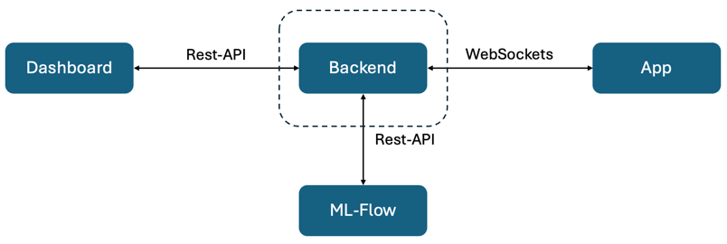

# MLFLOW-App
Backend zum Deployen und Überwachen von Modellen auf Edge-Devices. 

Pakete installieren: `pip install -r requirements.txt`

Starten: `uvicorn main:app --reload --host 0.0.0.0`
_______ 
### Architektur: 

[Dashboard-Repo](https://github.com/JonaBecher/MLOPS-dashboard) | [App-Repo](https://github.com/JonaBecher/MLOPS-App)

___
## API-Endpunkte

### Projektverwaltung
- **GET /projects**: Abrufen einer Liste aller Projekte.
- **POST /{projectId}/registerDevice**: Ein neues Edge-Device für ein Projekt registrieren.

### Modellverwaltung
- **GET /{projectId}/models**: Alle Modelle abrufen, die einem bestimmten Projekt zugeordnet sind.
- **GET /{projectId}/activeModel**: Das aktive Modell für ein bestimmtes Projekt herunterladen.
- **GET /{projectId}/download/{model_id}/{file_name}**: Herunterladen der Modelle.
- **POST /{projectId}/setModel**: Ein neues aktives Modell für ein Projekt festlegen.

### Verwaltung der Edge-Devices
- **POST /{projectId}/registerDevice**: Registrieren eines neuen Edge-Devices.
- **GET /{projectId}/devices**: Alle unter einem bestimmten Projekt registrierten Edge-Devices auflisten.
- **POST /{projectId}/setDark**: Nachtmodus für die Live-Demo.

### Daten und Metriken
- **GET /{projectId}/getStats**: Statistische Daten und Metriken für Modelle innerhalb eines Projekts abrufen.

### Verbindung zu Edge-Devices

- **WebSocket-Verbindung (/ws/{client_id}):** Bidirektionale Kommunikation für den kontinuierlichen Nachrichtenaustausch.

- **ModelVersion:** Informiert Edge-Devices über die aktuelle Modellversion und initiiert Updates bei Bedarf.

- **SetDark:** Ermöglicht die Steuerung des Nachtmodus für Live-Demo auf Edge-Devices.

- **UpdateModelVersion:** Benachrichtigt Geräte über neue Modellversionen zur automatischen Aktualisierung.

- **Metriken und Logs:** Erlaubt das Senden von Metriken und Logs in Echtzeit.

- **Verbindungsmanagement:** Überwacht die Online-Präsenz und erkennt Offline-Zustände von Geräten.

___
## Entwicklungswerkzeuge
- **SQLAlchemy**: ORM für Datenbankoperationen.
- **MLflow**: Integration für das Tracking von Experimenten, Modellen und Läufen.
- **FastAPI**: Framework für die Erstellung von APIs mit Python.
- **Pandas & NumPy**: Bibliotheken für Datenmanipulation und statistische Analyse.
